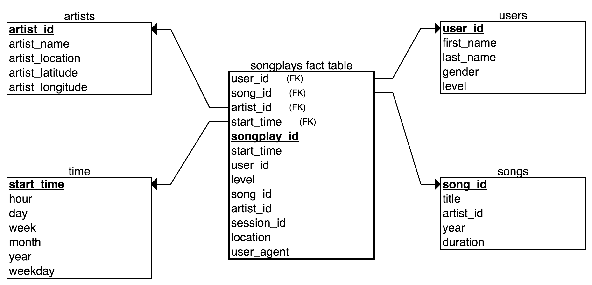

# UDE-postgres

The goal of this project is to generate a PostgreSQL database that hosts structured data related to song and user activity with the purpose of having a playground where we can obtain quick insigts via SQL queries. In order to implement this we will organize the database into different tables with a star shaped schema and ingest the data by means of and ETL (extract, transform, load) procedure.

## Song and Log datasets

The data used in this project is contained in two datasets: the Song dataset and the Log dataset. Both datasets can be found in the directory `./data`. 

### Song dataset

The Song dataset is a subset of the [Million Song Dataset](http://millionsongdataset.com). The data is organized in with the following file structure 

```
./data/song_data/
└── A
    ├── A
    │   ├── A
    │   ├── B
    │   └── C
    └── B
        ├── A
        ├── B
        └── C
```

where the parameters of the song (song_id, title, duration, etc...) and the information of its artist (artist id, artist name, artist location, etc...) are written in JSON format. As an example, you can find below the data corresponding to the song `./data/song_data/A/A/A/TRAAAAW128F429D538.json`

```
{
   "num_songs":1,
   "artist_id":"ARD7TVE1187B99BFB1",
   "artist_latitude":null,
   "artist_longitude":null,
   "artist_location":"California - LA",
   "artist_name":"Casual",
   "song_id":"SOMZWCG12A8C13C480",
   "title":"I Didn't Mean To",
   "duration":218.93179,
   "year":0
}
```

### Log dataset

The Log dataset contains information related to the data generated by the simulator of events [Eventsim](https://github.com/Interana/eventsim). Like the Song files, each log entry is written in JSON format and labeled by date. The log files contain similar data as the one present in activity logs from music streaming applications. Below you can find an example that ilustrates the schema of the log files 

```
{
    "artist":"Des'ree",
    "auth":"Logged In", 
    "firstName":"Kaylee",
    "gender":"F",
    "itemInSession":1,
    "lastName":"Summers",
    "length":246.30812,
    "level":"free",
    "location":"Phoenix-Mesa-Scottsdale, AZ",
    "method":"PUT",
    "page":"NextSong",
    "registration":1540344794796.0,
    "sessionId":139,
    "song":"You Gotta Be",
    "status":200,
    "ts":1541106106796,
    "userAgent":"\"Mozilla\/5.0 (Windows NT 6.1; WOW64) AppleWebKit\/537.36 (KHTML, like Gecko) Chrome\/35.0.1916.153 Safari\/537.36\"",
    "userId":"8"
}
```

## Database description

Since we are going to create the database from scratch we are going to design the database in a [normalized](https://en.wikipedia.org/wiki/Database_normalization) fashion with a [star schema](https://www.guru99.com/star-snowflake-data-warehousing.html). The star schema is widely used to implement databases where a heavy number of OLTP transactions will take place (like SQL DML statements). To this end, we are going to employ the `songplays` table as [fact table](https://en.wikipedia.org/wiki/Fact_table) and `users`, `songs`, `artists` and `time` as [dimension tables](https://en.wikipedia.org/wiki/Dimension_(data_warehouse)). While the fact table encapsulates the information about the songs played by the users along time, the dimension ones are employed for descriptive purposes like song, user, artists and time related data. The fields corresponding to each one of them are detailed below.

#### `songplays` fact table

```
songplay_id SERIAL PRIMARY KEY,
start_time BIGINT, 
user_id INT, 
level VARCHAR, 
song_id VARCHAR, 
artist_id VARCHAR, 
session_id INT, 
location VARCHAR, 
user_agent VARCHAR
```

#### `users` dimension table

```
user_id INT PRIMARY KEY,
first_name VARCHAR,
last_name VARCHAR,
gender VARCHAR,
level VARCHAR
```

#### `songs` dimension table

```
song_id VARCHAR PRIMARY KEY,
title VARCHAR,
artist_id VARCHAR,
year INT,
duration FLOAT
```

#### `artists` dimension table

```
artist_id VARCHAR PRIMARY KEY,
artist_name VARCHAR,
artist_location VARCHAR,
artist_latitude INT,
artist_longitude INT
````

#### `time` dimension table

```
start_time BIGINT PRIMARY KEY,
hour INT,
day INT,
week INT,
month INT,
year INT,
weekday INT
```

As one can see in the following figure, the fact table is connected to the dimension tables with foreign keys that make possible the use of JOIN statements to bring the data alltogether. This will be usefull when we need to get insights that require information from different tables. 



## Database setup and ETL pipeline

An automatized procedure was created in order to set-up the database with the aforementioned star schema and to integrate the song and log data in the database. Such a procedure is carried out in two separate steps: (1) database generation and (2) data ingestion. These stages are encapsulated in the python scripts `./create_tables.py` and `./etl.py` respectively. Below you can find a brief description of how they work. 

1. **Database generation**: the script `./create_table.py` makes use of the python library [`psycopg2`](https://www.psycopg.org/docs/) to create both the database named `sparkify` and the fact and dimensions tables. This is achieved my means of [`CREATE DATABASE`](https://www.postgresql.org/docs/9.0/sql-createdatabase.html) and [`CREATE TABLE`](https://www.postgresql.org/docs/10/sql-createtable.html) SQL DDL statements. As a measure of caution, before any `CREATE` operation a [`DROP DATABASE`](https://www.postgresql.org/docs/10/sql-dropdatabase.html) (or [`DROP TABLE`](https://www.postgresql.org/docs/10/sql-droptable.html)) statement is executed.

2. **Data ingestion**: the script `./etlp.py` contains the ETL pipeline employed to ingest the song and log data located in `./data` into the `songplays`, `users`, `songs`, `artists` and `time` tables. Similarly to the above step, the `psycopg2` library is used to set up a connecttion to the `sparkify` database and, after the data is extracted and transformed into the correct format, different [`INSERT`](https://www.postgresql.org/docs/10/sql-insert.html) SQL statements are employed to ingest data into these tables. This procedure is divided in two separate methods `process_song_file` and `process_log_file` according to the source of the raw data.

## Example queries

After the database is set up one can execute SQL queries to obtain insights on the data. Example queries are provided below:

### Example query 1: How many users purchased the paid subscription? In comparison, are there more free tier users than paid subscriptions?

```
SELECT 
    level, 
    COUNT(level) as level_count 
FROM users 
GROUP BY level 
ORDER BY level_count DESC
```

### Example query 2: What are the longest songs in the database?

```
SELECT 
    title, 
    duration 
FROM songs 
ORDER BY duration DESC 
LIMIT 5
```

### Example query 3: How many songs and artists are there in the database?

```
SELECT
    COUNT(DISTINCT(song_id)) AS number_songs, 
    COUNT(DISTINCT(artist_id)) AS number_artists 
FROM songs 
LIMIT 5
```

The queries above are included in the notebook `./example_queries.ipynb`.

## Requirements

Below you can find the requirements to run the scripts `./create_table.py` and `./etlp.py`.

1. [`psycopg2`](https://www.psycopg.org/docs/)
2. [`pandas`](https://pandas.pydata.org/)
